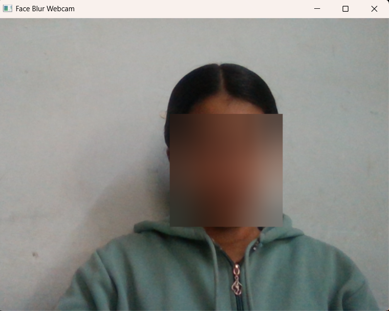

# Face Anonymizer

A simple computer vision project that detects and blurs faces in images and live webcam video.

## Features

* Detect faces in images
* Blur faces for privacy/anonymization
* Real-time webcam face blurring
* Save processed outputs

## Technologies Used

* Python
* OpenCV
* MediaPipe

## Libraries

This project uses:

* MediaPipe for face detection
* OpenCV for image processing and webcam access

## Project Structure

```
face-anonymyser
│
├── image_blur.py
├── webcam_blur.py
│
├── data
│   └── test_img.jpg
│
├── output
│   └── blurred_test_img.jpg
│
├── webcam_demo.png
│
├── requirements.txt
└── README.md
```

## Example Results

### Image Face Blur

Input image:

`data/celebrity.jpg`

Output image:

`output/blurred_celebrity.jpg`

### Webcam Face Blur

Example webcam output:



## Installation

Clone the repository:

```
git clone https://github.com/ankithathecoder/face-anonymyser.git
cd face-anonymyser
```

Create a virtual environment and install dependencies:

```
pip install -r requirements.txt
```

## Usage

Run image blur:

```
python image_blur.py
```

Run webcam blur:

```
python webcam_blur.py
```

Press **ESC** to exit the webcam window.

## Notes

Face detection is powered by a pretrained model from MediaPipe. No model training is required.
